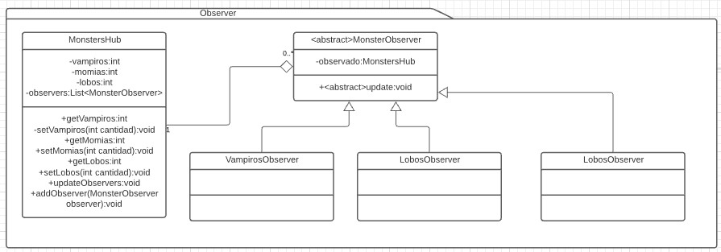

# Observer
Es un patron de comportamiento (behavioral). [Link descripcion](https://sourcemaking.com/design_patterns/observer)

Establece una relacion entre sujeto y observador donde al actualizarse algúna propiedad del 
sujeto, esté informa a todos sus observadores para que ellos a su vez se actualicen con los nuevos valores. Generalmente usado en la capa View de MVC (las Views son observers del Model)

## Diagrama de clases

## SOLID
* Single responsibility

El observer en sí tiene una sola responsabilidad, reaccionar a las actualizaciones del observado. El observado debe estar bien modelado para tener una sola responsabilidad, pero en principio esto es fehacible.

* Open/Close

Este principio también depende de una buena implementacion del observado, pero los observers en sí son compatibles totalmente ya que solo se debe heredar (o implementar) el Observer padre para obtener polimorfismo.

* Liskov substitution

No hay razón para que este principio no se pueda implementar, si queremos otra funcionalidad del observado basta con heredarlo, si queremos nueva funcionalidad del observer solo debemos heredar o implementar la interfaz MonsterObserver

* Interface segregation

Con un buen diseño del observado basta para conseguir cumplir con este principio.

* Dependency inversion

En este caso particular deberíamos extraer la interfaz de MonsterHub para cumplir con este principio completamente.